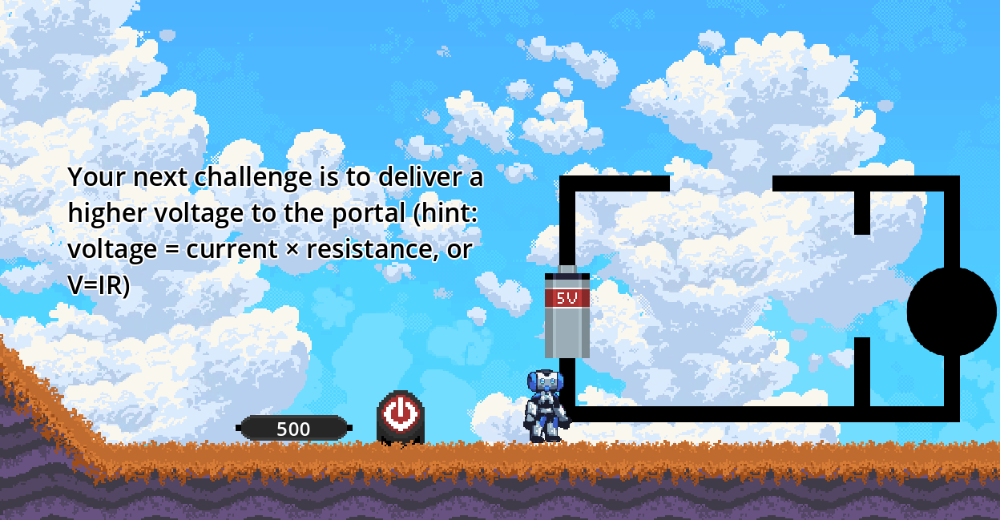
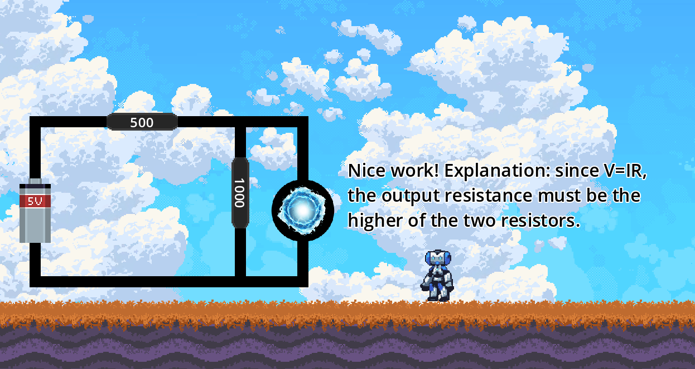
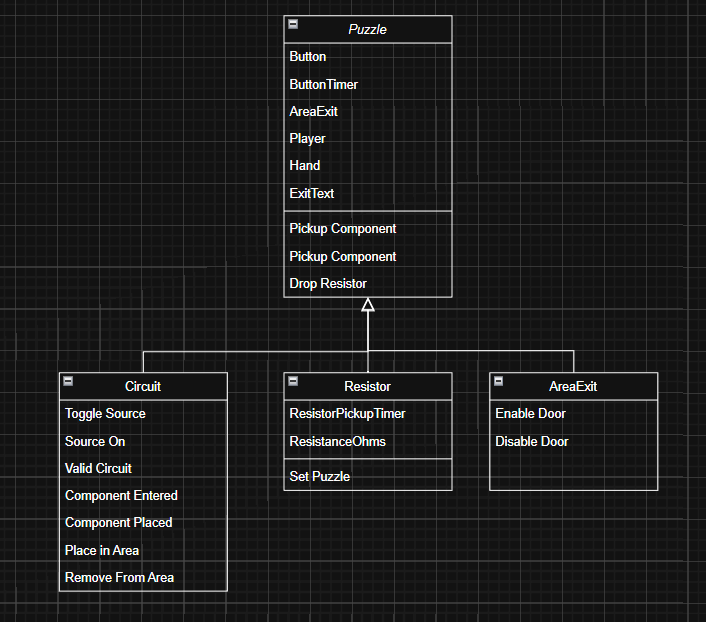

# Senior Project - Platforming For Circuit Education

## Screenshots

## Introduction
The purpose of this project was to provide an alternative for students being introduced to resistive circuits. As a freshman in electrical engineering (transferred to computer engineering), I saw the struggles of other freshman to grasp the conceptual basics of circuits. While there’s lots of guides to circuit education, many of them fall short of being both engaging and teaching the intuition behind circuits. A lot of the more advanced concepts in circuits depend on the basic intuition of KCL, KVL, and Ohm’s Law.

## Background
The game engine used for this project is Godot. This is an open-source game engine, capable of developing 2d and 3d games. It uses a functional program language similar to Python (called GDScript), and it relies on instances of classes created by the developer. I tried to stick to object-oriented programming principles like keeping functions with the classes they're related to. I also followed the rule of calling functions of descendants (rather than ascendants) and sending signals up (to ascendants).

## Puzzle Architecture
The following is how puzzles are laid out. On the split classes (Puzzle and Resistor), the top is child components, and the bottom is functions. For the rest, only functions are shown.

Also worth noting is there's a general circuit class, which several other circuits inherit from. The final version of this is the CircuitX class, designed to drop in with custom puzzles.

## Conclusion
I completed this project over the span of 6 months give or take, and I hope you learn something from this.